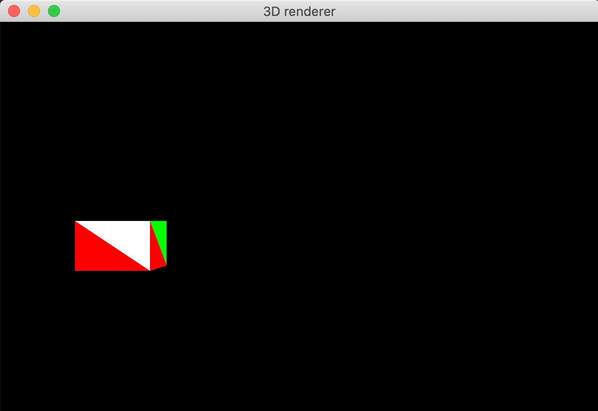

# Краткое объяснение как написать самому с нуля 3D-renderer на C++ и не умереть

Само руководство [тут](./docs/README.md).

## Зависимоти
* `conan` с включенным каналом [bincrafters](https://bincrafters.readthedocs.io/en/latest/)
* `cmake`

## Как собрать код
```bash
mkdir src/build
cd src/build
conan install ..
cmake -DCMAKE_BUILD_TYPE=Release ..
make
```

## Как запустить пример
```bash
cd src
python ./resources/generate.py
./build/bin/test
```

## Как это выглядит


## Автоматическая документация
С использованием `doxygen`:
```bash
cd src
doxygen doxygen
```
После этого открыть в браузере файл `src/docs/html/index.html`