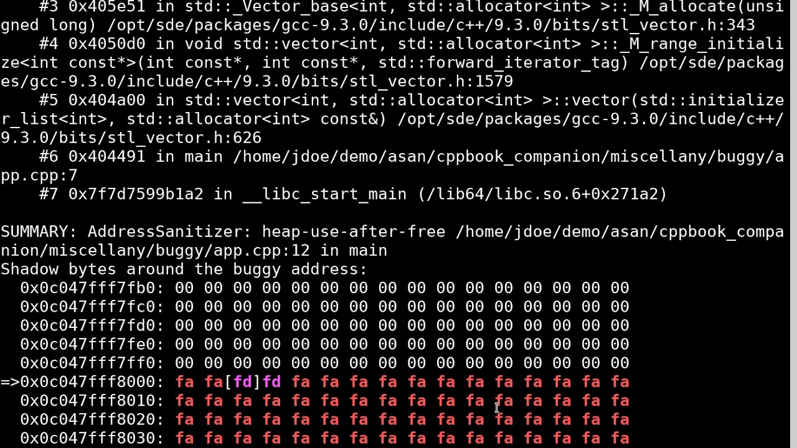

# Отладка и логирование

Основные практики при отладке `C++`

## Предупреждения компилятора
Во всех крупных проектах флаги `-Wall` и `-Werror` почти обязательны.

Если компилятор выдает предупреждение, то скорее всего это ошибка, или это имеет шансы в будущем стать ошибкой.

Если забыть поставить эти флаги, это может обернуться несколькими часами дебага случайного `segmentation fault`

## Debug сборка
Есть два типа сборки: `Debug` и `Release`.

`Release` заточен под максимальную производительность. Включены все оптимизации, часто удалена отладочная информация. Удалены `assert`.

`Debug` сборка заточена под поиск ошибок. Выключены оптимизации, все `assert` проверяются. Многие библиотеки в `Debug` режиме включают дополнительные проверки. С помощью специальных макросов (например `_GLIBCXX_DEBUG` и  `_GLIBCXX_DEBUG_PEDANTIC` в `gcc`) можно добиться еще большего числа проверок внутри стандартной библиотеке.

Очевидно что в `Debug` режиме искать ошибку проще.

## sanitizer
[Sanitizers](https://github.com/google/sanitizers) - разработка `google`, упростившая жизнь разработчикам многократно.

Они сильно замедляют выполнение программы, но проверят множество вещей таких как:

* Выход за границу массива
* double free
* Переполнение и другое неопределенное поведение
* Утечка
* data race

Включаются опциями `-fsanitize=address,undefined` или `-fsanitize=thread` (для data race и других многопоточных проблем)

Рекомендуется обычно так же указывать опцию `-fno-sanitize-recover`

Пример вывода санитайзера:

Как мы видим, пишется проблема `use-after-free` и стек вызовов с номерами строк в файлах

## assert
`assert` - макрос. Он проверяет условие и падает если оно ложно.

Важная его особенность - он работает только в `Debug` режиме, в `Release` он ничего не делает и не тратит время. Поэтому можно не бояться пихать его часто чтобы проверять что нигде в программе не возникла непредвиденной ситуации и все работает как и ожидалось.

## Логирование
Достаточно распространенная практика отладки - в каждой строчке что-нибудь выводить и так понимать где и что упало.

Однако это неудобно, вывода слишком много, его нельзя быстро уменьшить и потом вернуть обратно.

Поэтому появились библиотеки для логирования.

Они позволяют писать логи на нескольких уровнях. Обычно самые отладочные сообщения пишутся на уровне `debug`, и чтобы их скрыть не нужно их вырезать, а просто нужно запустить программу с уровнем логирования `info` или выше.

Минус этого подхода - если при выводе считается что-то тяжелое, оно продолжит считаться и занимать время (хотя и не во всех библиотеках).

Другой плюс логирования - возможность детальной настройки формата:

* время сообщения
* в каком потоке произошло
* значения важных переменных в это время
* температура воздуха на луне (шутка, но большинство логгеров действительно позволяют крайне гибко настраивать формат)

Я для логирования выбрал библиотеку `glog`, но есть и другие хорошие.

## Отладчики
Нельзя забывать и про отладчики, они могут сильно вам помочь:

* Покажут значения переменных в момент падения или когда что-то пошло не так, например вылетело исключение
* Покажут стек вызовов
* Дают возможность автоматизировать отладку, хоть это и пригождается крайне редко

Если ваша IDE предоставляет отладчик - скорее всего им будет пользоваться удобнее всего.

Из не привязанных к IDE отладчиков популярны два - `gdb` и `lldb`. Оба удобные, `gdb` немного более популярен. Так же они дают возможность удаленной отладки.